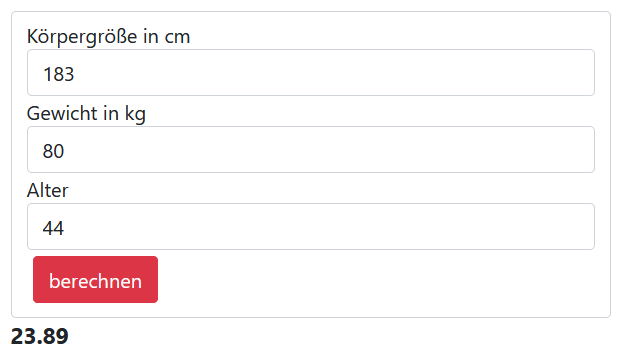

# bmi-rechner

Erstelle einen einfachen BMI Rechner (das Alter wird eigentlich nicht benötigt, kann aber bei der Auswertung anzeigen wie man im Verhältmis zu seiner Alterskohorte liegt).

Der BMI berechnet sich 

Nutze dein bisheriges Wissen um

1. beim Drücken des Berechnen Buttons die Daten aus
dem Formular zu holen und in eine Number umzuwandeln.
2. mit der Formel den BMI auszurechnen und
anzuzeigen.

Das Formular könnte so aussehen:

3. füge einen Button hinzu der die Werte wieder cleaned.